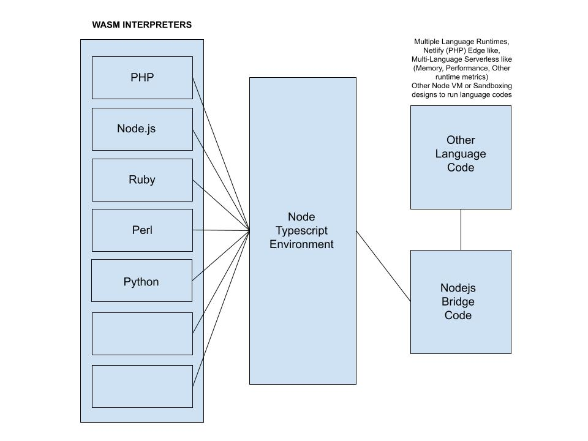

# bridge-wasm
`wasm bridges` for language interpretors like `php`, `perl`, `python`,`micropython`, `cpython`, `ruby`, `julia`, `cpp`, `golang`, `ocaml`, `lua`, `napi`, `wasm-run`, `r-lang`, `openssl`, important c libraries, and other important libraries

[bridge-wasm](./docs/Bridge-Wasm.jpg)

Credit: [many wasm packages taken from @polylang.io](https://github.com/chris-koch-penn/polylang.io/tree/master/wasm)

Expected risks or considerations for your designing for multiple interpreter designs:

- Load times (load wasm's during server start, and invoke plus run code dynamically based on need recommended)
- Memory limits, usages, leaks, and security
- Performance to OS based designs of serverless
- Performance to OS based designs of VM
- Sandboxing and security restrictions based on nodejs code
- File and OS access limitations or allowance based on runtime needs and models/ architecture
